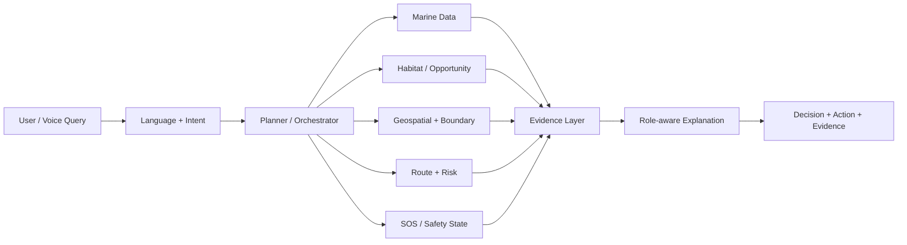
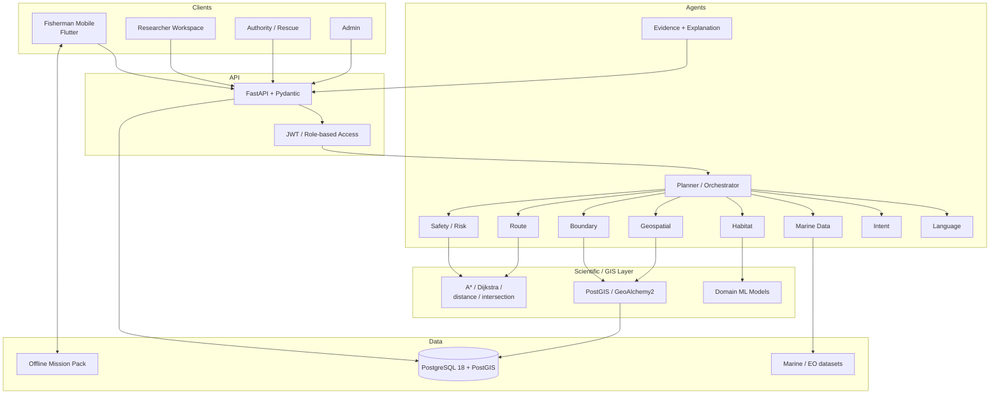

<div align="center">

# ORCA

### Marine EcOsystem Reasoning with Collaborative Agents

**An offline-first Agentic Marine Intelligence Platform for fishermen, marine researchers, coastal authorities and administrators.**

ORCA transforms complex satellite, oceanographic, weather and geospatial data into **clear, evidence-backed marine decisions** — while keeping scientific calculations inside domain models, GIS algorithms and deterministic safety logic rather than delegating them to a language model.

<p>
  
  
  
  
  
  
  
</p>

<p>
  <a href="#overview">Overview</a> ·
  <a href="#what-makes-orca-different">Why ORCA</a> ·
  <a href="#how-it-works">How it works</a> ·
  <a href="#role-based-experience">Roles</a> ·
  <a href="#agentic-intelligence-architecture">Architecture</a> ·
  <a href="#tech-stack">Tech stack</a> ·
  <a href="#getting-started">Getting started</a> ·
  <a href="#prototype-status">Prototype status</a>
</p>

</div>

---

## Overview

ORCA was built for **Smart India Hackathon 2026 — ISRO Problem Statement 26176**.

Marine decisions are rarely based on a single variable. A fisherman deciding whether to leave shore may need to consider waves, wind, current, tide, weather warnings, a fishing opportunity, vessel capability, route exposure and maritime boundaries at the same time. A researcher needs access to the underlying evidence and uncertainty, while a coastal authority needs an operational view of distress incidents, hazards and geofences.

ORCA brings those workflows into one system.

The platform combines **satellite Earth-observation data, marine forecasts, GIS layers, machine-learning models, deterministic scientific calculations and collaborative AI agents**. The result is not just another marine dashboard: ORCA converts heterogeneous marine evidence into a role-specific decision and an immediate next action.

For fishermen, the answer is intentionally simple:

> **Decision → Why → What to do → Evidence**

For researchers, the same system exposes a more technical view:

> **Datasets → Variables → Spatiotemporal context → Method → Result → Uncertainty → Provenance**

For authorities, ORCA becomes an operational command layer:

> **Incident → Position → Hazard context → Acknowledge → Assign → Resolve**

---

## What makes ORCA different

Most marine tools specialize in one part of the problem: weather visualization, navigation, scientific data access or incident handling. ORCA is designed around the **decision workflow that connects them**.

Its core engineering principle is:

> **Agents decide what needs to be done. Domain models make predictions. GIS and scientific algorithms perform calculations. The LLM explains the result.**

This separation is important. ORCA does **not** ask a language model to calculate a PFZ probability, marine distance, geofence intersection, route, wave-risk score, GPS position or SOS state. Those operations remain deterministic or model-driven.

ORCA stands out through five ideas:

- **Collaborative agent orchestration** — specialized language, intent, planning, marine-data, habitat, route, boundary, safety and explanation components cooperate on a query.
- **Decision-first fisherman UX** — the system leads with a clear action instead of overwhelming the user with raw marine data.
- **Offline-first mission intelligence** — route, boundary, mission and cached safety context are designed to remain useful when connectivity becomes unreliable at sea.
- **One intelligence layer, multiple roles** — fisherman, researcher, authority and admin views use the same underlying marine evidence but present it at the level each role needs.
- **Evidence and abstention** — freshness, provenance and uncertainty are first-class concepts; when required evidence is stale or unavailable, ORCA is designed to say so rather than fabricate certainty.

---

## How it works

A user starts with a natural-language or voice request. ORCA identifies the role, language, intent, location and required evidence. The planner/orchestrator then selects the necessary tools and agents.



A fisherman asking _“Is it safe to go tomorrow morning?”_ can trigger marine-condition retrieval, forecast-validity checks, hazard screening, route/boundary context and vessel-aware reasoning. A researcher asking _“Where are high chlorophyll and favourable SST regions?”_ follows a different workflow focused on spatial analysis, variables, model outputs and provenance.

ORCA therefore acts as an **orchestration layer over scientific tools**, not as a replacement for them.

---

## Role-based experience

### 1. Fisherman Mobile Copilot

The Fisherman experience is the primary mobile workflow and is built in **Flutter**.

#### Ask ORCA

A multilingual, voice-enabled marine copilot designed to answer practical questions such as:

- Is it safe to go now?
- What are the sea conditions near me?
- Which route has lower exposure?
- Where is the most suitable fishing opportunity?
- Am I approaching a restricted or unsafe area?

The response is intentionally concise for fishermen and keeps detailed evidence secondary.

**Real-world impact:** reduces the cognitive load of interpreting several disconnected marine sources while at sea.

#### Sea Conditions

Combines the available marine context into a single view: waves, wind, currents and related safety information.

**Real-world impact:** enables the fisherman to assess operating conditions before and during a mission.

#### Fishing Opportunity + Mission Planner

The prototype can select a fishing-opportunity destination and build marine route alternatives.

Routing uses **water-aware graph/path planning**. The target production design uses A*/Dijkstra-style route search where land or prohibited cells can be excluded and marine exposure can contribute to route cost.

ORCA can therefore distinguish between:

- **faster route**, and
- **lower-exposure route**

instead of treating shortest distance as automatically safest.

**Real-world impact:** helps a fisherman balance travel time, operating conditions and safety before starting a trip.

> Prototype fishing-opportunity zones are clearly labelled as demo/synthetic until the verified operational PFZ adapter is connected.

#### Vessel Profile

A fisherman stores vessel-specific context such as vessel identity, type and cruising-speed information.

That data supports:

- travel-time estimation,
- mission planning,
- route evaluation,
- vessel-specific safety context,
- emergency incident context.

During SOS, the vessel profile can travel with the distress context so the command centre understands **who is in distress, where they are and what vessel they are operating**.

**Real-world impact:** moves ORCA from generic marine advice toward vessel-aware decision support.

#### Boundary Guardian

ORCA checks marine geofences and boundary layers using geospatial calculations rather than language-model inference.

The production design supports:

- restricted/avoid areas,
- protected regions,
- boundary proximity,
- projected boundary crossing,
- offline cached geofence checks.

**Real-world impact:** gives fishermen earlier awareness before entering a restricted or unsafe area.

#### Offline Mission Pack

ORCA follows an offline-first design.

A mission pack is intended to preserve critical trip context such as:

- selected and alternate routes,
- mission waypoints,
- cached geofences and hazards,
- forecast snapshots and validity,
- evidence metadata,
- safe-return context.

The current prototype includes the core offline-readiness workflow and mission-pack state.

**Real-world impact:** critical navigation and safety context does not disappear simply because mobile connectivity becomes weak offshore.

#### SOS Survival Mode

SOS is deterministic and safety-critical.

The prototype supports a local incident lifecycle:

```text
QUEUED_LOCAL → ACKNOWLEDGED → ASSIGNED → RESOLVED
```

The UI deliberately distinguishes **queued**, **sent/acknowledged** and **resolved** states. ORCA must never claim that rescue is on the way unless a real acknowledgement exists.

The survival view is designed to combine:

- current fisherman position,
- vessel/mission context,
- safer return guidance,
- route bearing and distance,
- hazard awareness,
- rescue-command incident state.

**Real-world impact:** gives the fisherman useful survival guidance while also providing authorities with structured distress context.

---

### 2. Marine Researcher Workspace

The researcher experience uses the same marine intelligence layer but exposes the scientific evidence rather than simplifying it into only a Yes/No decision.

> In the current hackathon prototype, researcher views are accessible through the role-preview workflow. The production architecture targets the dedicated `web_dashboard/` application.

#### Ask ORCA Research — **Working in prototype**

Researchers can ask natural-language questions and receive a professional research-style response containing:

- finding,
- datasets,
- methodology,
- uncertainty,
- provenance,
- suggested next analysis.

Example:

> _Where are high chlorophyll and favourable SST regions?_

**Technology:** agentic query planning, marine-data adapters, structured evidence objects, geospatial context and role-specific explanation.

**Real-world impact:** shortens the path from a research question to an interpretable analysis while keeping the source evidence visible.

#### Data Explorer — **Working in prototype**

A spatial view for examining variables such as:

- SST,
- chlorophyll,
- wind,
- waves,
- currents,
- bathymetry,
- habitat/opportunity signals.

**Technology:** map layers, marine raster/vector data, geospatial processing, PostGIS-oriented spatial architecture and Flutter-map prototype visualization.

**Real-world impact:** allows researchers to compare multiple environmental variables within one spatial context instead of manually switching between separate portals.

#### Productivity Investigator — **Working in prototype**

Designed to examine how environmental suitability changes across time.

The prototype demonstrates relationships between changing marine variables and relative fishing suitability.

**Technology:** time-series comparison, environmental features, habitat-opportunity outputs and anomaly-oriented analysis.

ORCA intentionally avoids unsupported causation. Without validated landing or CPUE data, it describes **environmental indicators associated with reduced fishing suitability**, not biological causation.

**Real-world impact:** helps researchers quickly identify periods or areas that deserve deeper investigation.

#### Anomaly Detection — **Planned / not yet fully implemented**

Planned to identify unusual marine conditions relative to seasonal or historical behaviour.

Target methods include:

- seasonal normalization,
- temporal comparison,
- Isolation Forest / statistical anomaly detection,
- spatial anomaly mapping.

**Real-world impact:** can surface unusual temperature, chlorophyll or other marine-condition patterns earlier for scientific review.

#### Reports — **Planned / not yet fully implemented**

Designed to convert an ORCA analysis into a reproducible summary containing maps, variables, evidence, model/tool versions and provenance.

**Real-world impact:** reduces manual reporting effort and improves traceability from conclusion back to source data.

---

### 3. Marine Command Centre — Coastal Authority / Rescue

The Authority view connects fisherman safety with operational response.

#### Active SOS — **Working in prototype**

Receives a distress incident and exposes the operational lifecycle:

- queued,
- acknowledged,
- assigned,
- resolved.

The prototype can demonstrate fisherman-to-authority SOS state handling locally.

**Real-world impact:** gives rescue operators a structured incident instead of an uncontextualized distress message.

#### Hazard Map — **Prototype operational view**

Designed to combine incident locations, marine hazards, safer corridors and restricted areas on one map.

**Technology:** Flutter map prototype, geospatial layers, route geometry and PostGIS-oriented production architecture.

**Real-world impact:** creates a shared operating picture for emergency and hazard decisions.

#### Marine Alerts — **Prototype operational view**

Designed to synthesize safety-relevant information such as:

- high waves,
- tide context,
- cyclone proximity,
- lightning risk,
- route-corridor exposure.

**Real-world impact:** changes raw warning data into actionable operational context for affected areas and vessels.

#### Geofences — **Prototype operational view**

Maintains operational avoid, restricted, boundary-watch and safe-return zones.

**Technology:** spatial polygons, intersection/containment logic, PostGIS and on-device cached geofences.

**Real-world impact:** enables proactive boundary and restricted-area awareness rather than reacting after a crossing occurs.

#### Incident History — **Prototype operational view**

Preserves resolved incident state, response actions and outcomes.

**Real-world impact:** supports after-action review, recurring-risk analysis and operational accountability.

---

### 4. ORCA Administration

The administration layer focuses on **trust, observability and platform health** rather than marine decision-making.

#### Dataset Health

Tracks whether required marine sources are configured, available, fresh, stale or pending.

**Real-world impact:** prevents an apparently intelligent answer from hiding poor or outdated source data.

#### Model Registry

Tracks model identity, purpose, version and validation metrics.

The current experimental habitat-opportunity model is treated as a **relative suitability/opportunity ranker**, not an official PFZ probability model.

Current evaluation snapshot:

| Metric | Value |
| :-- | --: |
| ROC-AUC | 0.671 |
| PR-AUC | 0.487 |
| F1 | 0.437 |
| Brier score | 0.232 |

**Real-world impact:** allows technical teams to know which model produced an output and how it was validated.

#### Agent Monitoring

Provides visibility into the collaborative pipeline, including components such as:

- Language Agent,
- Intent Agent,
- Planner / Orchestrator,
- Context Agent,
- Marine Data Agent,
- Habitat Agent,
- Boundary Agent,
- Route Agent,
- Risk logic,
- Explanation Agent,
- SOS workflow.

**Real-world impact:** makes an agentic system inspectable instead of behaving like a single opaque chatbot.

#### System Health

Tracks readiness of major platform components such as the mobile client, backend, database, spatial layer, offline state and SOS prototype.

**Real-world impact:** helps operators distinguish a marine-data problem from a model, database, API or application problem.

---

## Agentic intelligence architecture

ORCA is intentionally modular.



---

## Safety and explainability rules

ORCA follows several hard rules:

1. **The LLM does not perform scientific calculations.**
2. **SOS state is deterministic.**
3. **A queued SOS is not described as acknowledged.**
4. **A synthetic/demo PFZ is never described as an official live PFZ.**
5. **Stale evidence can trigger abstention rather than false certainty.**
6. **Opportunity and safety are separate concepts.**
7. **Correlation is not reported as biological causation without the required evidence.**
8. **Marine routing is decision support, not autopilot.**

These rules are as important as the interface itself because ORCA operates in a safety-sensitive domain.

---

## Marine data and model layer

ORCA's data architecture is built to work with authoritative or scientifically recognized sources where available.

| Source / dataset | ORCA use | Prototype state |
| :-- | :-- | :-- |
| GEBCO | Bathymetry / depth features | Integrated locally |
| NOAA OISST v2.1 | Sea-surface temperature | Runtime adapter configured |
| Ocean-colour / chlorophyll data | Productivity / habitat features | Freshness-gated adapter |
| Open-Meteo marine/weather data | Development wave/wind context | Development integration |
| CMLRE records | Habitat training/reference | Used after QC |
| IndOBIS | Biodiversity occurrence reference | Used as supplemental/reference data |
| Official operational PFZ advisory | Verified fishing-zone candidate | Adapter pending |

The habitat model currently represents **experimental relative habitat opportunity/suitability**. It is not presented as an official PFZ classifier or calibrated fish-catch probability.

---

## Tech stack

| Layer | Technology |
| :-- | :-- |
| Fisherman mobile | Flutter, Dart, Material 3 |
| Mobile maps / GPS | `flutter_map`, Geolocator, LatLng |
| Voice | `speech_to_text`, `flutter_tts` |
| Local prototype state | SharedPreferences / cached mission state |
| Backend | Python, FastAPI, Uvicorn, Pydantic |
| ORM / migrations | SQLAlchemy, GeoAlchemy2, Alembic |
| Database | PostgreSQL 18 + PostGIS |
| Authentication | JWT, role-based backend checks, Fisherman phone OTP workflow |
| GIS | PostGIS, Shapely/PyProj-oriented geospatial services |
| Routing | Water-grid A* / Dijkstra-style path planning |
| ML | scikit-learn / gradient-boosting habitat-opportunity pipeline |
| Research / EO processing | Xarray / geospatial scientific-data pipeline |
| Web dashboard target | React, TypeScript, Vite |
| Version control | Git + GitHub |

---

## Prototype status

The project is intentionally transparent about what is implemented, prototyped and still planned.

| Area | Feature | Status |
| :-- | :-- | :-- |
| Fisherman | Phone OTP authentication | ✅ Implemented |
| Fisherman | Ask ORCA | ✅ Working prototype |
| Fisherman | Voice STT / TTS | ✅ Working prototype |
| Fisherman | Sea conditions | ✅ Implemented |
| Fisherman | Vessel profile | ✅ Implemented |
| Fisherman | Boundary Guardian | ✅ Implemented |
| Fisherman | Route planning | ✅ Implemented prototype |
| Fisherman | Fishing-opportunity demo flow | ✅ Synthetic prototype |
| Fisherman | Offline mission readiness | ✅ Core prototype |
| Fisherman | SOS Survival Mode | ✅ Working prototype |
| Researcher | Ask ORCA Research | ✅ Working prototype |
| Researcher | Data Explorer | ✅ Working prototype |
| Researcher | Productivity Investigator | ✅ Working prototype |
| Researcher | Anomaly Detection | 🟡 Planned / partial design |
| Researcher | Reports | 🟡 Planned |
| Authority | Active SOS lifecycle | ✅ Working prototype |
| Authority | Hazard Map | 🟡 Prototype operational view |
| Authority | Marine Alerts | 🟡 Prototype operational view |
| Authority | Geofences | 🟡 Prototype operational view |
| Authority | Incident History | 🟡 Prototype operational view |
| Admin | Dataset Health | 🟡 Prototype console |
| Admin | Model Registry | 🟡 Prototype console |
| Admin | Agent Monitoring | 🟡 Prototype console |
| Admin | System Health | 🟡 Prototype console |
| Data | Official live PFZ adapter | ⏳ Pending |

---

## Getting started

### Prerequisites

- Flutter SDK
- Android Studio / Android SDK
- Python virtual environment
- PostgreSQL 18
- PostGIS
- Git
- A physical Android device or emulator

The current development prototype has been run on Android with Flutter.

### 1. Clone the repository

```bash
git clone https://github.com/rutvatrivedi0906-arch/ORCA.git
cd ORCA
```

### 2. Start the FastAPI backend

On Windows PowerShell:

```powershell
cd backend
.\.venv\Scripts\Activate.ps1

python -m uvicorn app.main:app --reload --host 0.0.0.0 --port 8000
```

FastAPI documentation is available locally at:

```text
http://127.0.0.1:8000/docs
```

> Configure the backend environment and PostgreSQL/PostGIS connection used by your local installation before startup. Never commit `.env` files or secrets.

### 3. Prepare a physical Android device

Check the device:

```powershell
adb devices
```

When using a physical Android device with the backend running on the development PC, reverse port `8000`:

```powershell
adb reverse tcp:8000 tcp:8000
adb reverse --list
```

The Flutter app can then reach the local backend through:

```text
http://127.0.0.1:8000
```

### 4. Run the Flutter app

```powershell
cd marine_app

flutter pub get
flutter analyze
flutter devices
flutter run -d <device-id>
```

---

## Fisherman authentication flow

The production-oriented flow is:

```text
Splash
  ↓
Landing / Onboarding
  ↓
Language + Visual / Voice Guide
  ↓
Role Selection
  ↓
Fisherman Phone Number
  ↓
OTP Verification
  ↓
First-time Registration (if required)
  ↓
Backend-verified Fisherman Dashboard
```

The backend remains authoritative for role verification.

---

## Recommended prototype demo

A short end-to-end judging flow:

```text
Fisherman
  ↓
Ask ORCA
  ↓
Sea / Safety Decision
  ↓
Choose Fishing Opportunity
  ↓
Plan Route
  ↓
Select Lower-Exposure Route
  ↓
Prepare Offline Mission
  ↓
Start Mission
  ↓
Trigger SOS Survival Mode
  ↓
Authority acknowledges / assigns / resolves incident
  ↓
Researcher explores marine data and Ask ORCA Research
  ↓
Admin reviews datasets, models, agents and system health
```

---

## Testing

### Flutter static analysis

```bash
cd marine_app
flutter analyze
```

### Flutter tests

```bash
flutter test
```

### Backend

Run the backend and verify the OpenAPI interface:

```text
http://127.0.0.1:8000/docs
```

Key authentication endpoints include:

```text
POST /api/v1/auth/fisherman/request-otp
POST /api/v1/auth/fisherman/verify-otp
POST /api/v1/auth/fisherman/complete-registration
```

Safety-critical and geospatial behaviour should be validated independently from the language-model explanation layer.

---

## Project structure

```text
ORCA/
├── marine_app/            # Flutter Fisherman app + prototype role views
│   ├── lib/
│   │   ├── screens/       # Auth, dashboard, maps, SOS, researcher, authority, admin
│   │   ├── services/      # API, auth, mission, offline, SOS and marine services
│   │   ├── models/        # Flutter data models
│   │   └── core/          # Theme and shared app configuration
│   └── android/
│
├── web_dashboard/         # Production target for Researcher / Authority / Admin
│
├── backend/               # FastAPI backend
│   ├── app/
│   │   ├── agents/        # ORCA collaborative agents
│   │   ├── services/      # Marine, route, auth and domain services
│   │   ├── models/        # Database/domain models
│   │   └── main.py
│   └── alembic/           # Database migrations
│
├── ml/                    # Habitat-opportunity training/evaluation pipeline
├── data/                  # Local development / research data workspace
├── docs/                  # Architecture, presentation and project documentation
└── README.md
```

---

## Responsible-use limitations

ORCA is a **hackathon prototype and marine decision-support system**, not a substitute for official maritime warnings, legal navigation systems, SAR infrastructure or professional seamanship.

In particular:

- demo/synthetic values must remain visibly labelled,
- official advisories should override prototype data,
- emergency transmission requires real connectivity or authorized communication infrastructure,
- legal boundaries require authoritative datasets,
- model outputs should include freshness, uncertainty and provenance,
- safe-route guidance is advisory and must not be represented as autonomous navigation.

---

## Vision

ORCA's goal is to create a common marine-intelligence layer where:

- **fishermen receive simple, actionable and multilingual decisions,**
- **researchers receive evidence, methodology and uncertainty,**
- **coastal authorities receive incident and hazard awareness,**
- **administrators can monitor the data, models and agents behind every decision.**

> **ORCA — turning ocean data into decisions that matter.**

---

## Smart India Hackathon 2026

**Problem Statement:** 26176  
**Organization:** ISRO  
**Project:** ORCA — Marine EcOsystem Reasoning with Collaborative Agents

Built as a functional prototype for Smart India Hackathon 2026.
