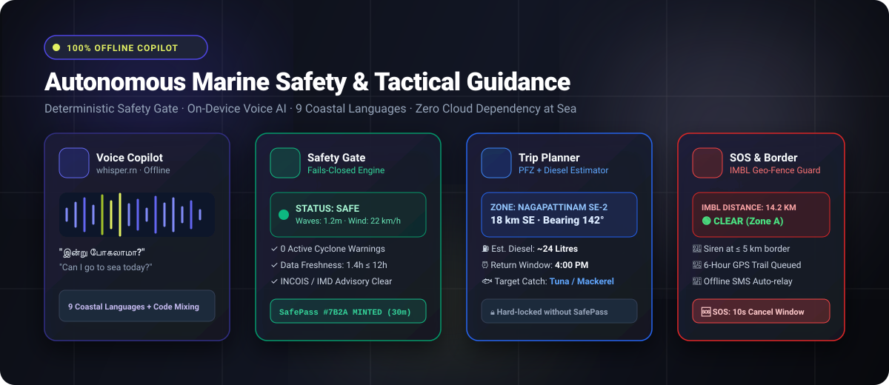
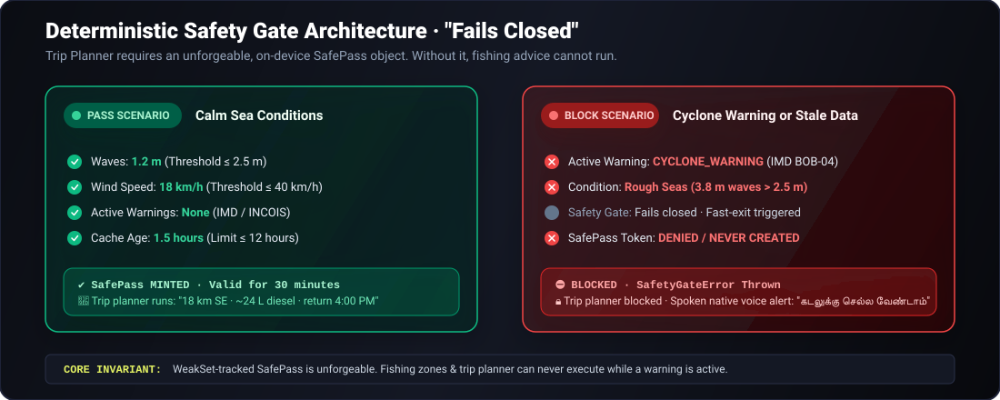
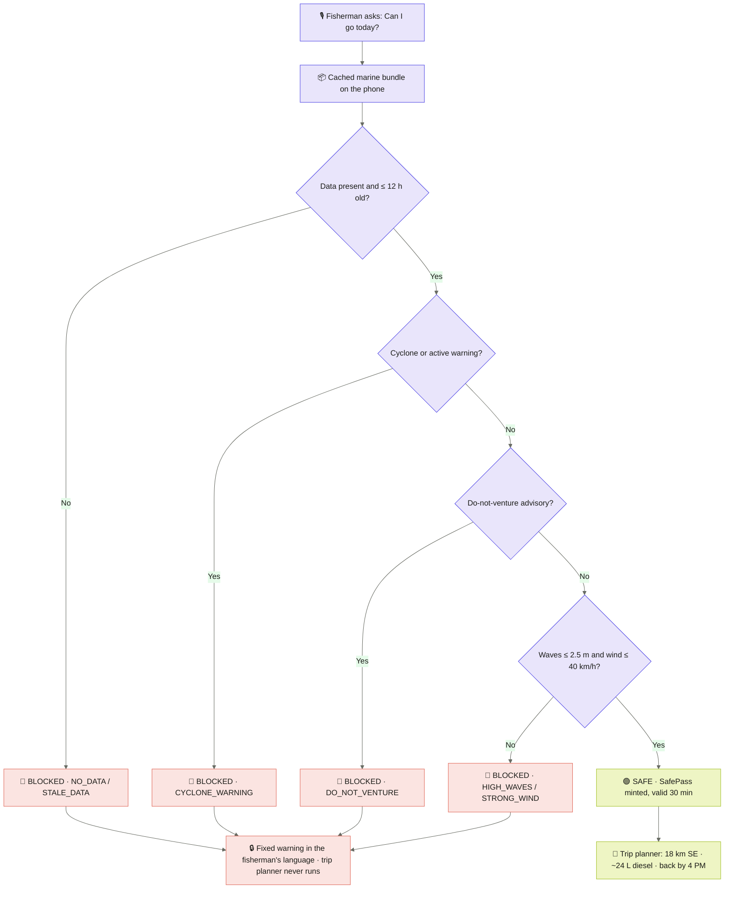
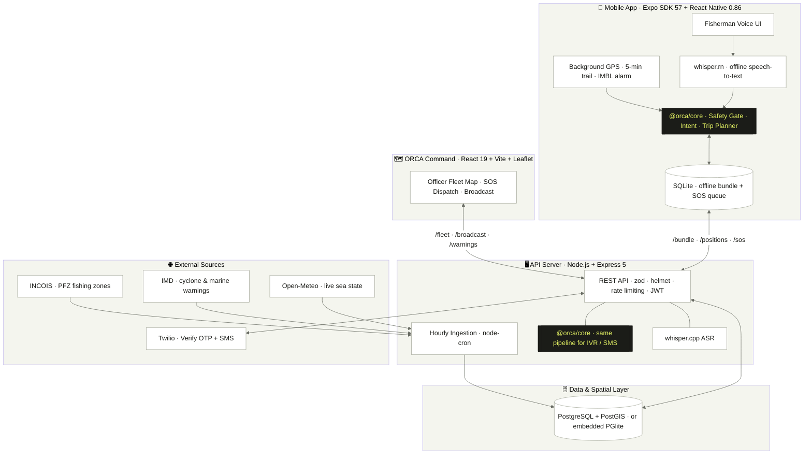
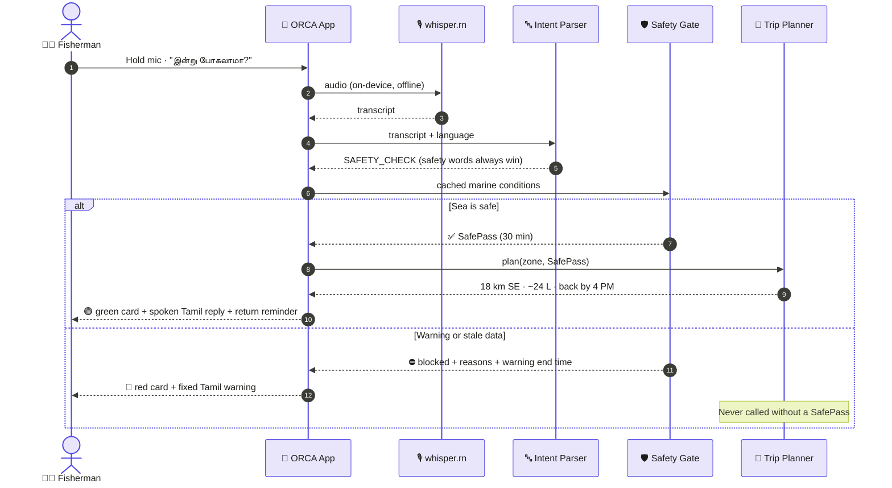
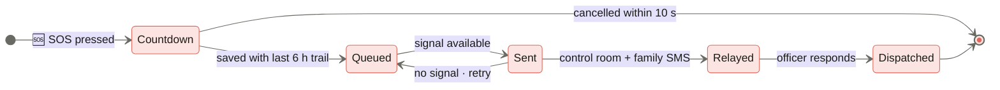
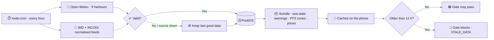
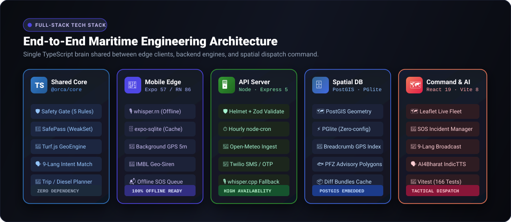

<div align="center">

<!-- 🚀 3D ANIMATED ACTION CARDS (FLOATING & GLOWING) -->
<a href="https://orca-app-gold.vercel.app/" target="_blank">
  
</a>
<a href="https://youtu.be/AvTgKgtaXi4?si=TJEleu4jrHjlt5Ll" target="_blank">
  
</a>

<br/>

> **📲 Download Apk file : [https://orca-app-gold.vercel.app/](https://orca-app-gold.vercel.app/) &nbsp;&nbsp;|&nbsp;&nbsp; ▶️ Youtube Link = [https://youtu.be/AvTgKgtaXi4?si=TJEleu4jrHjlt5Ll](https://youtu.be/AvTgKgtaXi4?si=TJEleu4jrHjlt5Ll)**

<br/>


<br/>

<a href="https://orca-app-gold.vercel.app" target="_blank">
  
</a>

<br/>

[](https://expo.dev/)
[](https://nodejs.org/)
[](https://postgis.net/)
[](https://react.dev/)
[](https://github.com/ggerganov/whisper.cpp)

<br/>


<br/>

> **🌊 "Jaan pehle, kamai baad me." A voice-first, offline copilot that tells a fisherman whether it is safe to go to sea, and where the fish are, in his own language. When a warning is active, the fishing advice cannot run at all.**

[📲 **DOWNLOAD APK**](https://orca-app-gold.vercel.app/) &nbsp;•&nbsp; [▶️ **YOUTUBE DEMO**](https://youtu.be/AvTgKgtaXi4?si=TJEleu4jrHjlt5Ll) &nbsp;•&nbsp; [🌐 **LIVE WEBSITE**](https://orca-app-gold.vercel.app) &nbsp;•&nbsp; [⚡ **UNIQUE FEATURES**](#-unique-features--competitive-advantage) &nbsp;•&nbsp; [👥 **STAKEHOLDERS**](#-stakeholder-matrix--ecosystem-impact) &nbsp;•&nbsp; [🏗️ **ARCHITECTURE**](#-system-architecture) &nbsp;•&nbsp; [🧰 **TECH STACK**](#-tech-stack--engineering-matrix) &nbsp;•&nbsp; [🚀 **QUICKSTART**](#-quickstart)

<br/>



</div>

---

<br/>

<div align="center">
  
</div>

<br/>

Most traditional marine apps are complex dashboards of raw numbers: confusing wave height tables, wind barbs, and lengthy advisories written in English or formal script that assume continuous 4G connectivity and literate users. **ORCA completely redesigns the maritime experience** by translating complex meteorological feeds into **one definitive, spoken answer** in the fisherman's mother tongue.

### 📊 Traditional Marine Systems vs. ORCA Copilot

| Capability | Traditional Portals (INCOIS / mKRISHI / NavIC apps) | 🌊 ORCA Marine Safety Copilot | Impact on Fishermen |
| :--- | :--- | :--- | :--- |
| **Decision Delivery** | Tables, contour maps, raw data (e.g. *"Significant Wave Ht: 2.8m"*) | **Binary, Spoken Decision:** *"கடலுக்கு செல்ல வேண்டாம்"* (Do not go) or *"Safe to sail"* | Zero cognitive load; immediate clarity for tired or illiterate crew |
| **Offline Independence** | Requires active 4G/cellular signal to load maps & data | **100% Offline-First:** On-device SQLite bundle + local speech models | Works 40+ nautical miles deep into the ocean with zero signal |
| **Safety Decision Integrity** | LLM chatbots or manual user interpretation of PDFs | **Deterministic Safety Gate:** Pure testable logic (`WeakSet` SafePass token) | **No AI hallucinations.** Missing/stale data fails closed automatically |
| **Language & Dialects** | English / Hindi; difficult formal translations | **9 Coastal Languages:** Speech recognition tailored for noisy boat decks + code-mixed slang | Full inclusion across Tamil Nadu, AP, Kerala, WB, Odisha, Maharashtra, etc. |
| **Emergency Text Translation** | Google Translate API (frequently distorts maritime terms) | **Pre-validated Fixed Templates:** Reviewed with native coastal communities | Zero ambiguity in critical life-or-death storm advisories |
| **Border Awareness** | Manual GPS coordinate verification | **Proactive IMBL Siren:** 5 km audio siren, vibration & spoken *"turn back"* alarm | Prevents accidental cross-border detentions and boat confiscation |
| **Emergency SOS Handling** | Fails or hangs if internet connection is missing | **Offline-Queued SOS:** 10s cancel buffer + 6-hour GPS trail auto-flushed on signal | Rescue teams receive accurate breadcrumbs even after complete power loss |
| **Trip Planning & Economics** | Only displays fish zones; no route planning | **Fuel & Sunset Planner:** Estimates diesel burn (L) and calculates return ETA before dusk | Saves ₹1,500–₹4,000 per voyage in fuel and prevents night strandings |

<br/>

### 🌟 The 8 Core Innovations of ORCA

```
 ┌────────────────────────────────────────────────────────────────────────────────────────┐
 │                              8 PILLARS OF ORCA RESILIENCE                              │
 ├─────────────────────────┬──────────────────────────┬───────────────────────────────────┤
 │ 🛡️ Fail-Closed Gate     │ 🔒 Code-Locked SafePass  │ 🎙️ On-Device Whisper Voice AI     │
 │ No AI in safety choices │ Private WeakSet token    │ Offline STT in 9 coastal dialects │
 ├─────────────────────────┼──────────────────────────┼───────────────────────────────────┤
 │ 📝 Zero Machine Trans   │ 🚩 5-km IMBL Siren Guard │ 🆘 6-Hour GPS SOS Breadcrumb      │
 │ Pre-verified templates  │ Audio + haptic + voice   │ Queued offline, flushed on signal │
 ├─────────────────────────┼──────────────────────────┴───────────────────────────────────┤
 │ ⛽ Fuel & Daylight Plan │ 🔄 Unified @orca/core Brain (Runs identically on Phone & Server)│
 │ Saves diesel & time     │ Single codebase powers Mobile, Command Web, SMS & IVR        │
 └─────────────────────────┴──────────────────────────────────────────────────────────────┘
```

- **🛡️ 1. Safety Gate that Fails Closed:** Five deterministic checks run with zero LLM guesswork. Missing, corrupted, or stale data (older than 12 hours) automatically **blocks** fishing advice instead of assuming conditions are safe.
- **🔒 2. Code-Locked SafePass Token:** A safe result mints a cryptographic `SafePass`. The trip planner refuses to run without one, guaranteeing that during a storm warning the fishing path is physically unreachable.
- **🎙️ 3. Voice-First & 100% Offline AI:** Powered by on-device **whisper.cpp** (`whisper.rn`), intent extraction handles 9 Indian coastal languages and vernacular code-mixed speech even amidst heavy boat-engine noise.
- **📝 4. Zero Machine Translation for Safety Text:** Every warning uses fixed, pre-written, native-speaker vetted templates in தமிழ் · తెలుగు · മലയാളം · বাংলা · ଓଡ଼ିଆ · मराठी · ಕನ್ನಡ · हिन्दी · English.
- **🚩 5. Proactive IMBL Border Siren:** A multi-stage alert engine activates a full-screen siren, continuous vibration, and a spoken *"turn back"* at 5 km from the India–Sri Lanka maritime border.
- **🆘 6. Fault-Tolerant Offline SOS:** A 10-second cancel window prevents accidental triggers, followed by bundling the **last 6 hours of GPS trail** into an offline queue that flushes automatically over SMS or cellular network.
- **🧭 7. Tactical Trip & Fuel Planner:** Balances Potential Fishing Zone (PFZ) distances against boat speed, diesel consumption (~24 L for typical day trips), and solar daylight to set a strict return deadline.
- **🗺️ 8. ORCA Command Dual-Sync:** District fisheries officers can broadcast real-time emergency orders that inject directly into **every vessel's local Safety Gate** on their next synchronization.

<br/>

---

<br/>

<div align="center">
  
</div>

<br/>

ORCA unites coastal communities, emergency responders, port authorities, and government agencies into a unified, high-reliability safety grid.

| # | 🏛️ Stakeholder | 🎯 Core Objective & Role | ⚠️ Traditional Bottlenecks & Gaps | 🚀 ORCA Solution & Value Proposition | 📱 Primary Channel |
| :-: | :--- | :--- | :--- | :--- | :--- |
| **1** | **Traditional & Artisanal Fishermen** | Daily livelihood, near-shore and motorized canoe fishing | Illiteracy, language barriers, inability to interpret meteorological barbs | Spoken, single-tap answers in native dialects; zero dependency on internet at sea; instant voice safety verification | 📱 Mobile App (Offline Voice) |
| **2** | **Mechanized Boat Skippers & Trawler Owners** | Multi-day deep-sea voyages, crew safety, profit margins | High diesel expenditures (₹3,000–₹8,000/day wasted searching), risk of hitting international borders | Fuel-optimized routes to validated PFZ zones; 5-km IMBL border sirens; return countdown before weather turns | 📱 Mobile App + GPS Breadcrumbs |
| **3** | **State Fisheries Departments & Coastal Officers** | Maritime safety enforcement, advisory dissemination, fleet tracking | No real-time visibility into boats at sea; paper-based warnings ignored by crews | **ORCA Command Dashboard:** Live fleet map, district broadcasts that enforce app-level lockouts, one-click boat SMS | 🗺️ ORCA Command (Web GIS) |
| **4** | **Indian Coast Guard (ICG) & Coastal Security Police** | Border security, counter-encroachment, Search and Rescue (SAR) | Delayed distress calls; zero coordinates or drift patterns during rescue ops | Instant SOS dispatch with **last 6 hours of GPS breadcrumbs**; proactive alarms preventing border trespass | 🗺️ Command Dashboard + Auto-SMS |
| **5** | **Meteorological & Oceanographic Institutes (INCOIS / IMD / CMFRI)** | Cyclone tracking, ocean state forecasting, PFZ dissemination | Low ground-level adoption of advisories; technical bulletins misunderstood | Standardized ingestion pipeline normalizing feeds into deterministic, actionable safety rules for the grassroots | ⚙️ Automated Ingest Pipelines |
| **6** | **Fishermen Families & Coastal Villages** | Crew welfare, household financial security, peace of mind | Agonizing uncertainty during severe weather; no means of contacting boats offshore | Automated return notifications; family SMS alerts during SOS; verified emergency communication channels | 💬 Direct SMS Alerts & IVR |
| **7** | **Harbour Masters & Cooperative Societies** | Jetty traffic management, catch logistics, auction price stabilization | Bottlenecks at landing centers; unexpected emergency boat returns | Transparent harbour bundles with live wholesale price tracking, dock return ETA estimation, organized fleet dispersal | 🌐 Web Portal & Harbour Kiosks |

<br/>

---

<br/>

<div align="center">
  
</div>

<br/>



<br/>



| # | Check | Blocks when | Reason code |
| :-: | :--- | :--- | :--- |
| 1 | **Warnings** | any IMD / INCOIS / officer warning is active | `CYCLONE_WARNING` · `ACTIVE_WARNING` |
| 2 | **Waves** | above **2.5 m**, or unknown | `HIGH_WAVES` · `NO_DATA` |
| 3 | **Wind** | above **40 km/h**, or unknown | `STRONG_WIND` · `NO_DATA` |
| 4 | **Advisory** | a "do not venture" advisory is issued | `DO_NOT_VENTURE` |
| 5 | **Freshness** | data is older than **12 hours** | `STALE_DATA` |

> 🔒 *Calling the trip planner without a genuine, unexpired SafePass throws `SafetyGateError: Fishing advice requires a SafePass issued by the Safety Gate.` A pass can only be created inside `evaluateSafety()`, where it is tracked in a private `WeakSet`, so a forged object is always rejected.*

<br/>

---

<div align="center">
  
</div>

<br/>

One shared brain, **`@orca/core`**, runs **identically on the phone and on the server**. The phone never needs a connection to make a safety decision.



<br/>

---

<div align="center">
  
</div>

<br/>



<br/>

---

<div align="center">
  
</div>

<br/>



| Border level | Distance to IMBL | What the fisherman gets |
| :--- | :--- | :--- |
| 🟢 `CLEAR` | more than 10 km | normal operation |
| 🟠 `WATCH` | 10 km or less | warning chip on the home screen |
| 🔴 `ALARM` | 5 km or less | full-screen alarm · siren · vibration · spoken *"turn back"* |
| ⛔ `CROSSED` | across the line | crossed-border message until the boat returns |

> ⚠️ *The IMBL coordinates in `packages/core/src/imbl.ts` come from the published 1974/1976 agreements. Replace them with the official Survey of India / Coast Guard dataset before real-world use.*

<br/>

---

<div align="center">
  
</div>

<br/>



Sea state comes live from **Open-Meteo** every hour for 9 harbours, one per coastal language. IMD and INCOIS do not publish stable JSON APIs, so the server accepts one normalised feed per source (shapes in `apps/server/src/ingest/feeds.ts`). If a source fails, the last good data is kept, and its age stays visible on every phone.

<br/>

---

<div align="center">
  
</div>

<br/>

| Role | Where | Access & rules |
| :--- | :--- | :--- |
| **Fisherman** | 📱 Mobile app | OTP login, language + harbour + family contact, Safety Gate answers, trip plans, SOS, trail upload |
| **Fisheries Officer** | 🗺️ ORCA Command | Allow-listed officer role, live fleet map, SOS dispatch, per-boat SMS, 9-language district broadcast, officer warnings |
| **Anyone (no login)** | 🌐 API | Health, harbour bundles, OTP, **SOS (never rejected, idempotent)**, speech-to-text, `/ask` for IVR / SMS channels |

> 🔒 *An officer warning is not just a notification. It is stored as a warning, so it enters **every phone's Safety Gate** on the next bundle and blocks fishing advice across the district.*

<br/>

---

<div align="center">
  
</div>

<br/>

<div align="center">
  <a href="https://skillicons.dev">
    
  </a>
</div>

<br/>



<br/>

| Tier | Package / Module | Primary Technologies | Technical Rationale & Role |
| :--- | :--- | :--- | :--- |
| 🧠 **Shared Brain** | `@orca/core` | `TypeScript` · `Turf.js` · `SunCalc` | Decoupled core library running on both React Native mobile and Node.js backend. Handles `WeakSet` unforgeable SafePass tokens, 9-language intent parsing, sun azimuth, and distance-to-line geofencing. |
| 📱 **Mobile Edge Client** | `@orca/mobile` | `React Native 0.86` · `Expo SDK 57` · `whisper.rn` · `expo-sqlite` | 100% offline-first native mobile application. Runs local quantized speech models, stores marine bundles in SQLite, maintains background 5-minute GPS trails, and sounds IMBL border sirens. |
| 🖥️ **Server & API Engine** | `@orca/server` | `Node.js` · `Express 5` · `Zod` · `Helmet` · `JWT` | Production RESTful API. Enforces strict input validation with Zod, rate-limiting, Twilio SMS/OTP dispatch, Whisper.cpp server fallback, and district-wide safety broadcast routing. |
| 🗄️ **Spatial Data Layer** | `@orca/data` | `PostgreSQL 16` · `PostGIS 3` · `PGlite` | Geospatial persistence of fleet trajectories, PFZ polygons, and harbour telemetry. Powered by embedded **PGlite + PostGIS** for instant zero-config testing and cloud PostgreSQL in production. |
| 🗺️ **Command Center** | `@orca/dashboard` | `React 19` · `Vite 8` · `Leaflet` · `React-Leaflet` | Mission command console for state fisheries authorities. Displays live vessel positions, triggers SOS response protocols, and issues instant multilingual storm warnings. |
| 🔊 **Voice & Audio Pipeline** | `tools/voice` | `Python 3.11` · `AI4Bharat IndicTTS` · `whisper.cpp` | Offline neural voice generation and high-accuracy speech recognition fine-tuned for noisy maritime environments and 9 Indian coastal tongues. |
| 🧪 **Quality & Invariants** | Workspace Root | `Vitest` · `Supertest` · `EAS Build` | Strict continuous verification with 166 automated unit & integration tests, verifying the Safety Gate, cryptographic SafePass immutability, and PostGIS queries. |

<br/>

---

<div align="center">
  
</div>

<br/>

### 1️⃣ Clone & install

```bash
git clone <your-repo-url> orca
cd orca
npm install            # installs every workspace (npm workspaces)
```

### 2️⃣ Run the platform

```bash
npm run server         # API on :4000 · embedded PostGIS · live Open-Meteo sea state
npm run dashboard      # ORCA Command on :5173 (set VITE_API_URL if the API is not on :4000)
npm run mobile         # Expo · scan the QR code with Expo Go (SDK 57)
```

### 3️⃣ Prove the Safety Gate

```bash
npm test               # 166 tests · 127 core + 39 server
npm run test:gate      # just the Safety Gate proof (show this to the jury)
npm run test:db        # server store against a real embedded PostGIS (~40 s)
```

> 💡 *Dev login everywhere: any number, OTP `123456`. In ORCA Command, **Load demo fleet** puts 40 simulated boats on the map. Without a server, the app runs in **offline demo mode** on bundled Nagapattinam scenarios. To connect a phone to your PC, set `EXPO_PUBLIC_API_URL=http://<your-PC-IP>:4000` in `apps/mobile/.env`.*

> 📦 *Android APK: built in the cloud with EAS (no local Android SDK needed). See [`docs/BUILD.md`](docs/BUILD.md), or grab the latest build from the [website](https://orca-app-gold.vercel.app).*

<br/>

---

<div align="center">
  
</div>

<br/>

| # | Do this | You'll see |
| :-: | :--- | :--- |
| 1 | Log in: pick **தமிழ்**, choose *Fisherman*, OTP `123456` | Home screen with the big mic |
| 2 | Tap **"இன்று போகலாமா?"** | 🟢 Green card + spoken Tamil: 18 km SE, ~24 L diesel, back by 4:00 PM |
| 3 | ⚙ Settings → Demo scenario → **Cyclone day**, then ask again | 🔴 Red card, warning until *வியாழன் மாலை 6:00* · Zone Map locked |
| 4 | Run `npm run test:gate` | ✅ Every test passes |
| 5 | Turn on airplane mode, ask again | Still answers · data age still visible |
| 6 | Press **SOS** | 10 s cancel window → queued with 6 h trail → SMS opens → auto-flush on signal |
| 7 | ⚙ Settings → Demo boat position → **Near border** | Full-screen alarm, siren and spoken "turn back" |
| 8 | After a green answer | "Return reminder set for 4:00 PM" · 2 notifications scheduled |

<br/>

<details>
<summary><b>🔌 API reference (click to expand)</b></summary>

<br/>

| Endpoint | Access | What it does |
| :--- | :--- | :--- |
| `GET /health` | anyone | store, OTP/SMS/ASR mode, last ingestion |
| `GET /harbours` · `GET /bundle?harbour=` | anyone | offline bundle: sea state + warnings + PFZ zones + prices |
| `POST /auth/otp` · `POST /auth/verify` | anyone | OTP login (Twilio Verify, dev code `123456`); officer role is allow-listed |
| `GET` · `PATCH /me` | logged in | language, harbour, family contact |
| `POST /sos` | **anyone** | never rejected, idempotent; texts the control room and family in the fisherman's language |
| `POST /positions` | fisherman | breadcrumb upload → fleet map |
| `POST /asr` | anyone | audio → text via whisper.cpp (503 → phone falls back to buttons) |
| `POST /ask` | anyone | same core pipeline server-side, for IVR / SMS channels |
| `GET /fleet` · `GET` · `PATCH /sos` | officer | boats at sea, border status, return ETA, SOS dispatch |
| `POST /broadcast` · `POST /notify` | officer | district warning in every language; text one boat |
| `GET` · `POST` · `DELETE /warnings` | officer | officer warnings that enter every phone's Safety Gate |
| `POST /demo/scenario` · `POST /ingest/run` | officer | stage a demo scenario; run ingestion now |

</details>

<details>
<summary><b>📁 Repository layout (click to expand)</b></summary>

<br/>

```
orca/
├── packages/core        @orca/core: shared brain (phone AND server)
│   ├── src/safetyGate.ts    5 checks · fails closed · unforgeable SafePass
│   ├── src/intent.ts        keyword intent · 9 languages + code-mixing · no LLM
│   ├── src/tripPlanner.ts   Turf.js distance · direction · diesel · return-by
│   ├── src/copilot.ts       question → gate → fixed-template answer
│   ├── src/imbl.ts          India–Sri Lanka border distance + side-of-line
│   ├── src/trail.ts         breadcrumb trail · 1 point / 5 min · last 6 h
│   ├── src/i18n/            fixed templates: ta te ml bn or mr kn hi en
│   └── test/                127 tests
├── apps/mobile          Expo SDK 57 / React Native app (fisherman + officer)
├── apps/server          Express + PostGIS: ingestion, OTP, SOS relay, fleet, ASR
├── apps/dashboard       ORCA Command: React + Vite + Leaflet
├── tools/voice          render fixed safety sentences to clips (IndicTTS)
└── docs/BUILD.md        Android APK build with EAS
```

</details>

<details>
<summary><b>🧭 Safety principles (click to expand)</b></summary>

<br/>

- **No AI in the safety decision:** plain `if/else`, deterministic and testable.
- **Fails closed:** missing, unreadable or stale (more than 12 h old) data blocks the fishing answer.
- **No machine translation for safety text:** fixed templates, with native-speaker review tracked in `packages/core/TRANSLATIONS.md`.
- **Over-triggering is acceptable, a miss is not:** safety keywords override fishing keywords.
- **The data's age is always visible.**

</details>

<br/>

---

<div align="center">


*ORCA: built for the fishermen of India's coast · Smart India Hackathon 2026 · SIH26176* 🇮🇳

</div>
